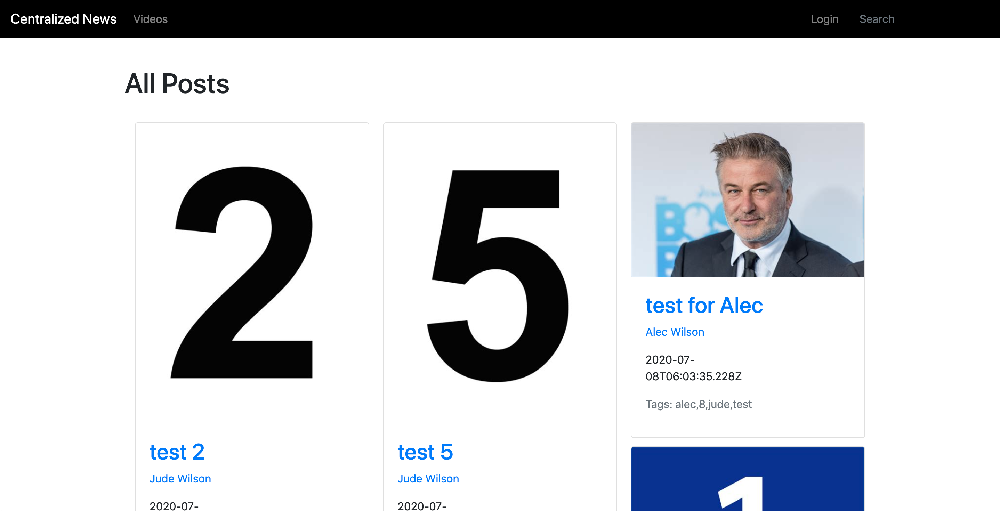
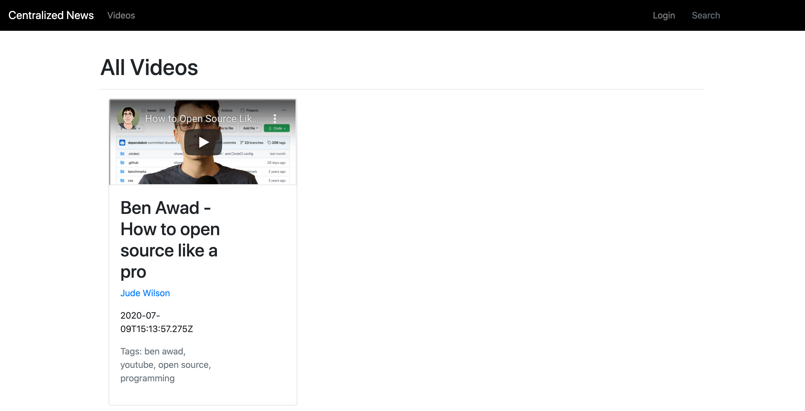
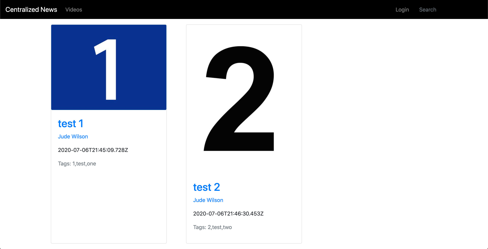
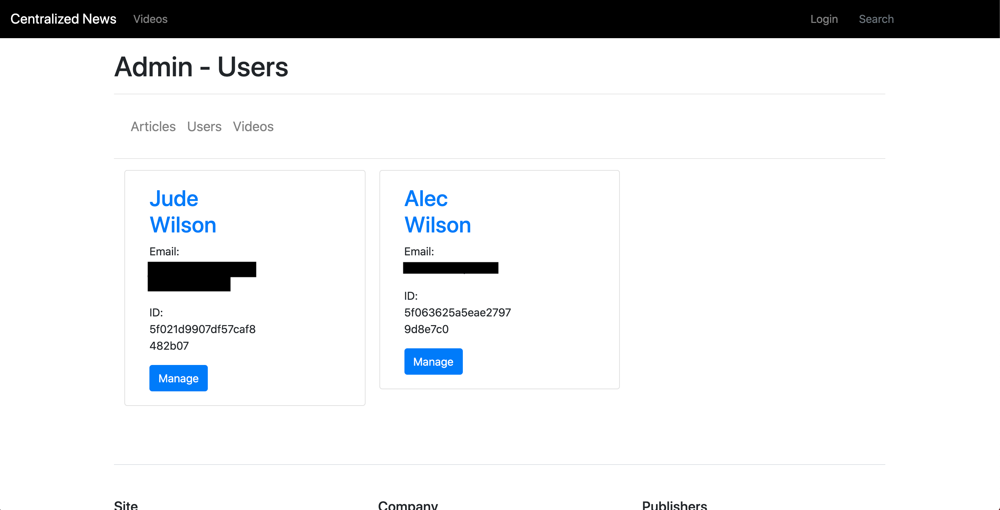
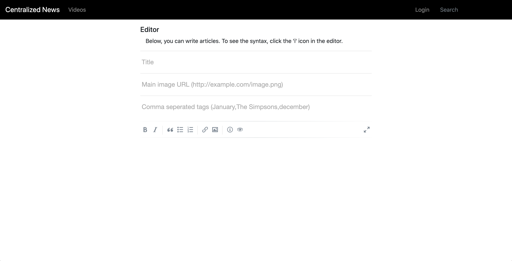
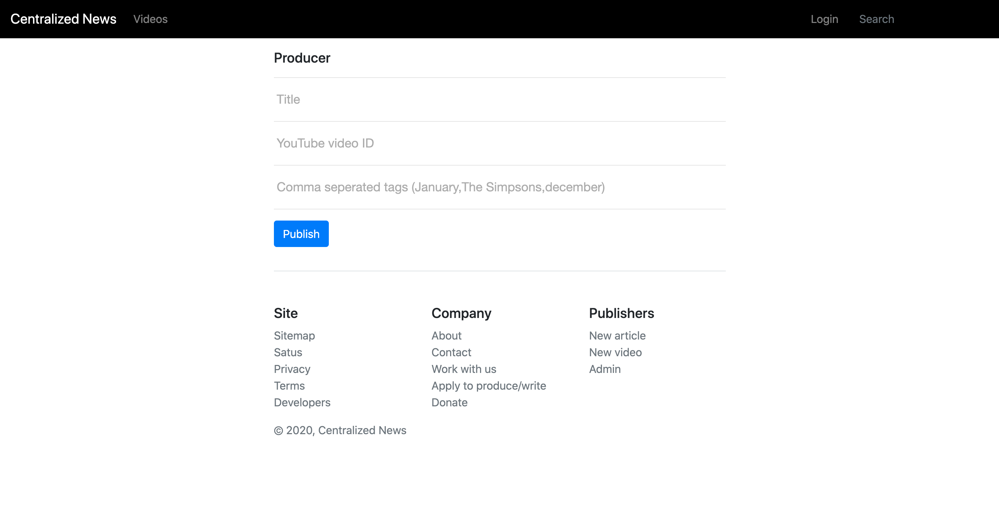

# Nodium
Nodium is still in heavy development including, not having user models, or anything else.
 
Nodium is an open-source Medium alternative that supports article posting! 
A demo is available at https://nodium-demo.herokuapp.com/

# Setup
To run your own instance, you will need to install some pre-requesites: 
`mongoDB`

After you have installed mongoDB, you can run the following commands to get your own instance running: 

        # clone the repository onto your local computer
        git clone http://github.com/mr-winson/nodium.git 

        # go to the nodium directory
        cd nodium 

        # install node modules
        npm i
Then go into the .env file and edit it to your needs. 

        # start the web server on port 3000
        npm start
Then browse to <a href="http://localhost:3000">localhost on port 3000</a>.

# Features
### General Features
Nodium supports admin users, normal users, writers, producers, and mods. It also supports video and article uploading. This site is PWA ready and only needs some things changed in the manifest in the public directory. Apple touch screen is also supported already. This site uses Bootstrap for CSS and EJS for templating.

### Home Page
The home page is where most people will spend there time, that is why we have all articles come up in a tab right below a tab with suggested articles based off what you like! As seen in the image below:
  

### Video Page
It is just like the <a href="#home-page">home page</a> but for videos!
  

### Search Page
The search page index titles, tags, and bodies. You can specify searches for videos or articles. Which ever article has the best match for your search term will come first.
  

### Administration
The first user to create an account is given admin permissions, with admin permissions, you can give other users writer (articles), producer (videos), and admin permissions. You can also delete videos, articles, and users.
  

### Editors
There are video and article editors, each one has there custom POST requests. Each including tags and a title, with the video editor there is also a spot for YouTube video ID. And with the article editor there is also a body textarea which supports Markdown as well as a main image input area.
| Article Editor | Video Editor |
|-----------|-----------|
|    |  |